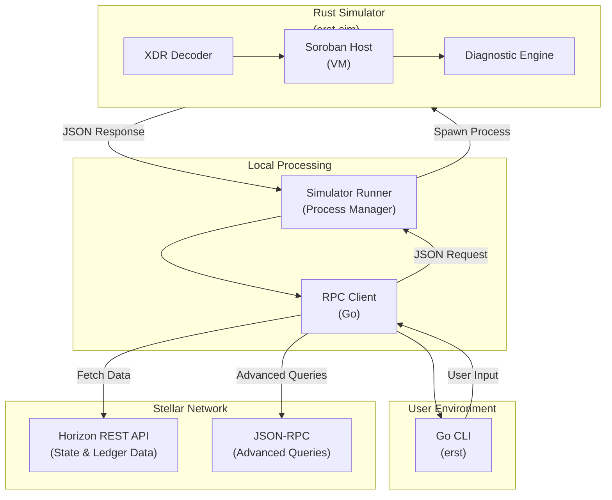

## Overview

Erst is a Soroban debugging and error decoding tool for the Stellar network. It bridges the gap between opaque XDR error codes and developer-friendly transaction analysis through transaction replay and local simulation.

The architecture consists of three core components:

1. **Go CLI** (`erst`): Command-line interface for user interaction
2. **RPC Client**: Stellar network data fetching via Horizon API and JSON-RPC
3. **Rust Simulator** (`erst-sim`): Soroban transaction execution and diagnostics

## System architecture



## Data flow

The transaction debugging workflow follows this sequence:

<Steps>
  <Step title="Fetch transaction envelope">
    The Go CLI requests transaction data from the Stellar network via Horizon API using the transaction hash.
  </Step>
  
  <Step title="Retrieve ledger state">
    The RPC client fetches the complete ledger state including `TransactionEnvelope`, `ResultMetaXDR`, and `LedgerEntries` at the transaction execution point.
  </Step>
  
  <Step title="Create simulation request">
    The CLI constructs a `SimulationRequest` containing the envelope XDR, result metadata, and ledger entries as a JSON payload.
  </Step>
  
  <Step title="Execute simulator">
    The Runner spawns the Rust simulator process and passes the JSON request via stdin.
  </Step>
  
  <Step title="Replay transaction">
    The simulator decodes XDR structures, initializes the Soroban Host VM with ledger state, and executes the transaction.
  </Step>
  
  <Step title="Collect diagnostics">
    During execution, the simulator captures diagnostic events, execution logs, and error traces.
  </Step>
  
  <Step title="Return results">
    The simulator outputs a JSON response via stdout containing status, events, logs, and error information.
  </Step>
  
  <Step title="Display to user">
    The CLI parses the response and displays formatted results including error traces and diagnostic information.
  </Step>
</Steps>

## IPC protocol

The Go CLI and Rust simulator communicate through JSON serialization over stdin/stdout.

### Request format

```json
{
  "envelope_xdr": "base64-encoded-transaction-envelope",
  "result_meta_xdr": "base64-encoded-transaction-result-meta",
  "ledger_entries": {
    "base64-key-1": "base64-ledger-entry-1",
    "base64-key-2": "base64-ledger-entry-2"
  }
}
```

| Field | Type | Purpose |
|-------|------|-------|
| `envelope_xdr` | String (Base64) | Complete signed transaction envelope ready for execution |
| `result_meta_xdr` | String (Base64) | Transaction result metadata from the blockchain (optional) |
| `ledger_entries` | Map (Base64 → Base64) | Read/write set of ledger entries at transaction time |

### Response format

```json
{
  "status": "success",
  "error": null,
  "events": ["event1", "event2"],
  "logs": ["log1", "log2"]
}
```

| Field | Type | Purpose |
|-------|------|-------|
| `status` | String | Execution status: "success" or "error" |
| `error` | String \| Null | Error message if status is "error" |
| `events` | Array | Diagnostic events emitted during execution |
| `logs` | Array | Detailed execution logs for debugging |

## Component details

### Go RPC client

**Location:** `internal/rpc/client.go`

**Responsibilities:**
- Establish connections to Stellar Horizon API
- Fetch transaction envelopes and metadata
- Query ledger state at specific transaction points
- Support multiple networks (Mainnet, Testnet, Futurenet)
- Standardized middleware for custom request/response interceptors

**Key functions:**

```go
// Client manages Stellar network interactions
type Client struct {
    Horizon horizonclient.ClientInterface
    Network Network
}

// NewClient creates network-specific RPC client with functional options
func NewClient(opts ...ClientOption) (*Client, error)

// WithMiddleware adds custom RoundTripper middleware
func WithMiddleware(middlewares ...Middleware) ClientOption

// GetTransaction fetches transaction context
func (c *Client) GetTransaction(ctx context.Context, txHash string) (*TransactionResponse, error)
```

**Network support:**

- **Mainnet:** `https://horizon.stellar.org`
- **Testnet:** `https://horizon-testnet.stellar.org`
- **Futurenet:** `https://horizon-futurenet.stellar.org`

### TypeScript RPC client (Protocol V2)

**Location:** `src/rpc/`

The TypeScript RPC client provides Protocol V2 enhancements for the Stellar SDK.

**Key features:**

- **Fallback support**: Automatic failover across multiple RPC endpoints
- **Circuit breaker**: Prevents cascading failures with configurable threshold and timeout
- **Batch requests**: Execute multiple RPC calls in a single request (Protocol V2)
- **Type-safe methods**: Full TypeScript support for all RPC methods
- **Request/response validation**: Built-in validation for RPC requests and responses
- **Performance metrics**: Real-time endpoint health monitoring

```typescript
const client = new FallbackRPCClient(config);

// Individual type-safe calls
const health = await client.getHealth();
const tx = await client.getTransaction(hash);

// Batch requests (Protocol V2)
const results = await client.batchRequest([
    { id: 1, method: 'getHealth', params: {} },
    { id: 2, method: 'getLatestLedger', params: {} },
]);
```

### Simulator runner

**Location:** `internal/simulator/runner.go`

**Responsibilities:**
- Locate and execute the `erst-sim` Rust binary
- Validate simulation requests before processing
- Manage subprocess lifecycle
- Handle IPC communication via stdin/stdout
- Deserialize simulation results

**Key functions:**

```go
// Runner manages simulator subprocess execution
type Runner struct {
    BinaryPath string
    Debug      bool
    Validator  *Validator
}

// NewRunner creates runner with binary discovery
func NewRunner(simPathOverride string, debug bool) (*Runner, error)

// Run executes simulation with request (includes validation)
func (r *Runner) Run(ctx context.Context, req *SimulationRequest) (*SimulationResponse, error)
```

**Binary discovery priority:**

<Steps>
  <Step title="Flag override">
    `--sim-path` command-line flag
  </Step>
  <Step title="Environment variable">
    `ERST_SIM_PATH` environment variable
  </Step>
  <Step title="Local directory">
    `./erst-sim` or `./bin/erst-sim` in current working directory
  </Step>
  <Step title="Development target">
    `./simulator/target/release/erst-sim` or `./simulator/target/debug/erst-sim`
  </Step>
  <Step title="Global PATH">
    `erst-sim` in system PATH
  </Step>
</Steps>

<Note>
The Runner includes a `Validator` that performs comprehensive schema validation before processing, including base64 encoding checks, required field validation, and ledger entry validation.
</Note>

### Rust simulator

**Location:** `simulator/src/main.rs`

**Responsibilities:**
- Decode XDR structures from Base64
- Initialize Soroban Host VM with ledger state
- Execute transaction and capture diagnostics
- Generate execution trace and error information

**Execution pipeline:**

1. Read JSON from stdin and deserialize to `SimulationRequest`
2. Extract and Base64-decode `envelope_xdr`, `result_meta_xdr`, and `ledger_entries`
3. Initialize Soroban Host VM with ledger state
4. Set diagnostic level to Debug mode
5. Execute transaction in VM
6. Capture diagnostic events and execution logs
7. Build execution trace with status and errors
8. Serialize to JSON and write to stdout

## State management

When debugging a transaction, Erst must capture the exact ledger state at the point of execution.

### State consistency requirements

| State element | Source | Purpose |
|---------------|--------|-------|
| Account balance | Horizon API | Verify sender has funds |
| Contract state | Ledger entries | Execute contract logic |
| Sequence numbers | Account query | Validate transaction ordering |
| Fee pool | Ledger query | Calculate fee impacts |

<Warning>
State snapshots must be taken at the exact ledger sequence number where the transaction was executed. Using state from a different ledger will produce incorrect simulation results.
</Warning>

## Event correlation and error tracing

The Soroban Host emits structured diagnostic events during execution. Erst correlates these with transaction failures to provide meaningful error messages.

### Error classification

<Accordion title="Execution errors">
- Trap/Panic
- Assertion failure
- Out of bounds
</Accordion>

<Accordion title="Logic errors">
- Invalid state transition
- Permission denied
- Contract violation
</Accordion>

<Accordion title="Resource errors">
- Out of gas
- Memory exceeded
- Instruction limit
</Accordion>

<Accordion title="Network errors">
- Invalid signature
- Bad sequence
- Insufficient balance
</Accordion>

## Performance considerations

### Optimization strategies

- **Minimize state transfer**: Only fetch read/write set using JSON-RPC pagination
- **Fast local execution**: Pre-compile WASM if needed and cache Host state
- **Efficient data format**: Use Base64 encoding for portability and compressed XDR for large states

### Benchmarking metrics

- **State fetch time**: Horizon latency + payload size
- **Simulation time**: WASM execution + event collection
- **Memory usage**: Host VM state + ledger cache
- **End-to-end**: User request → result display

## Integration points

The system integrates with multiple external services and libraries:

- **Horizon Client**: Stellar Horizon API
- **spf13/cobra**: Command framework
- **zap**: Logging system
- **serde_json**: JSON serialization
- **soroban-env-host**: Soroban Host VM
- **base64**: XDR encoding

### Future integration points

<Info>
Planned integrations include:
- JSON-RPC Client for direct ledger queries
- WebAssembly Inspector for WASM-level debugging
- Source Map Integration to map to Rust source
- Event Database for persistent event logging
- Dashboard/Web UI for visual debugging interface
</Info>

## Development setup

### Building the project

```bash
# Clone and navigate
git clone https://github.com/dotandev/hintents.git
cd hintents

# Build Rust simulator
cd simulator
cargo build --release
cd ..

# Build Go CLI
go build -o erst ./cmd/erst

# Run tests
go test ./...
```

### Environment variables

```bash
# Simulator binary location (optional)
export ERST_SIM_PATH=/path/to/erst-sim

# Network selection
export STELLAR_NETWORK=testnet  # or mainnet, futurenet
```

## Testing architecture

### Unit testing

- **RPC client tests**: Mock Horizon API responses
- **Runner tests**: Test subprocess execution and IPC
- **Serialization tests**: Validate JSON encoding/decoding

### Integration testing

Integration tests use both live network data and test fixtures:

- **Live network**: Testnet transactions with real Horizon data
- **Test fixtures**: Mocked data for deterministic testing

### CI/CD pipeline

CI and automation are treated as part of the architecture:

- **General CI**: `.github/workflows/ci.yml`
- **Strict linting**: `.github/workflows/strict-lint.yml`
- **CI robustness**: `.github/workflows/ci-standardization.yml`

**Helper scripts:**
- `scripts/validate-ci.sh` — validates CI configuration and versions
- `scripts/test-ci-locally.sh` — mirrors CI checks locally
- `scripts/lint-strict.sh` — strict linting and verification

<Note>
All scripts compute the repository root from their own location instead of assuming they are invoked from the project root, removing implicit global state dependencies.
</Note>
